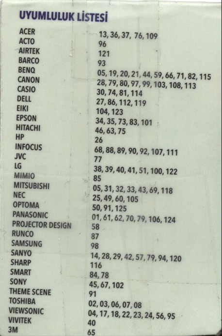

# remote-controller-maza-mz8002-v6-user-guide

# Kullanım Kılavuzu

**MZ-8002-V6 Öğrenebilen + Universal Projeksiyon Kumandası**

### 1. Kodla Arama

- ON ve 1 tuşuna aynı anda 3 saniyeden fazla basınız. LED yanmaya başladığında, 2 haneli kodu giriniz (örneğin: 01, 10, 71). Kod marka karşılık listesi aşağıda verilmiştir.
- Kod girdikten sonra ON tuşuna tekrar basarak kodu kaydediniz ve tuşları test ediniz.
- Projeksiyonunuza uyuyorsa kullanmaya başlayınız.
- Uymuyorsa, markanın yanında yazılı diğer kodları deneyiniz.

**NOT:** Eğer 10 saniye içinde kod girmezseniz kumanda otomatik olarak kod giriş işleminden çıkacaktır.

### 2. Öğreterek Programlama

Eğer kumandanızdaki kodlar sizin projektörünüzü açmadı ise, çalışan bir kumanda bulup kumandanıza öğretebilirsiniz.

1. ON ve 2 tuşuna aynı anda basınız. LED yanmaya ve kumanda öğrenmeye başlayacaktır.
2. Öğretmek istediğiniz 8002-V6'da ki tuşa (Power gibi) basınız. LED yanıp sönmeye başlayacaktır. Şu an öğrenme modundasınız.
3. Orijinal projeksiyon kumandanızı 8002-V6 ile karşı karşıya gösterin (1-2 cm mesafeden).
4. Öğretmek istediğiniz orijinal kumandada ki (Power gibi) tuşa 8002-V6'da ki LED sönene kadar basılı tutunuz. Tekrar yandığında tuşunuz öğrenmiş olacaktır.
5. Diğer tuşları öğretmek için 2.2'den 2.4'e kadar olan işlemleri her bir tuş için tekrarlayınız.
6. Öğrenme işleminden çıkmak için ON ve 3 tuşuna aynı anda basınız. 10 saniye içinde işlem yapılmazsa işlem otomatik olarak çıkacaktır ve öğrettiğiniz tuşlar hafızada kalacaktır.

**ÖNEMLİ NOT:** Lütfen kumandanızı sağlıklı kullanmak için iyi kalite AAA pil kullanınız.

### Uyumluluk Listesi

- **ACER**: 13, 36, 37, 76, 109
- **ACTO**: 96
- **AIRTEK**: 121
- **BARCO**: 93
- **BENQ**: 05, 19, 20, 21, 44, 59, 66, 71, 82, 115
- **CANON**: 28, 79, 80, 97, 99, 103, 108, 113
- **CASIO**: 30, 74, 81, 114
- **DELL**: 27, 86, 112, 119
- **EIKI**: 104, 123
- **EPSON**: 34, 35, 73, 83, 101
- **HITACHI**: 46, 63, 75
- **HP**: 26
- **INFOCUS**: 68, 88, 89, 90, 92, 107, 111
- **JVC**: 77
- **LG**: 38, 39, 40, 41, 51, 100, 122
- **MIMIO**: 85
- **MITSUBISHI**: 05, 31, 32, 33, 43, 69, 118
- **NEC**: 25, 49, 60, 105
- **OPTOMA**: 50, 91, 125
- **PANASONIC**: 01, 61, 62, 70, 79, 106, 124
- **PROJECTOR DESIGN**: 58
- **RUNCO**: 87
- **SAMSUNG**: 98
- **SANYO**: 14, 28, 29, 42, 57, 79, 94, 120
- **SHARP**: 116
- **SMART**: 84, 78
- **SONY**: 45, 67, 102
- **THEME SCENE**: 91
- **TOSHIBA**: 02, 03, 06, 07, 08
- **VIEWSONIC**: 04, 17, 18, 22, 23, 24, 56, 95
- **VIVITEK**: 40
- **3M**: 65

---

---

